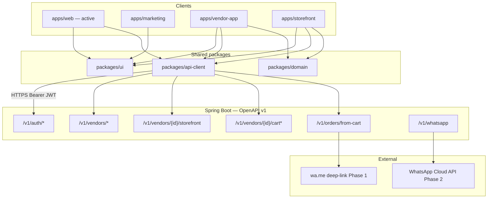
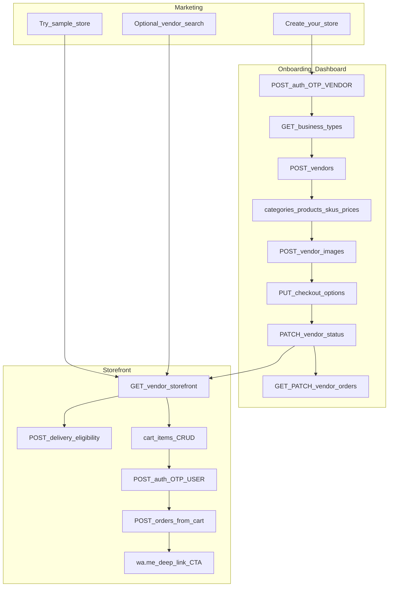

# MithraDirect SaaS — Plan & Design Document

**Status:** Implementation in progress (UI ↔ API integration)  
**Audience:** Principal engineers, product, and frontend/backend implementers  
**Last updated:** 2026-08-06  
**Prototype / HTML ground truth:** repo root `*.html` + `assets/*`  
**React app (active):** `apps/web` (marketing, onboarding, storefront, dashboard features)  
**API base URL:** `https://subscriptionapp-wgf8.onrender.com/api`  
**OpenAPI:** [Swagger UI](https://subscriptionapp-wgf8.onrender.com/api/swagger-ui/index.html) · [OpenAPI JSON](https://subscriptionapp-wgf8.onrender.com/api/v3/api-docs)  
**OpenAPI source used for this revision:** live fetch of `/api/v3/api-docs` (2026-08-06)  
**OpenAPI title / version:** MithraDirect- / `v1` — **113 paths**, **~150 operations**, **121 schemas**

---

## 1. Executive summary

MithraDirect is a multi-tenant commerce SaaS that lets local vendors publish a branded web storefront and take orders that complete over WhatsApp. The repository now contains:

1. **Static HTML shells** (UX ground truth): marketing (`index.html`), vendor onboarding (`onboarding.html`), customer storefront (`store.html`), vendor dashboard (`dashboard.html`).
2. **React 19 + TypeScript monorepo** with shared packages (`@mithra/api-client`, `@mithra/ui`, `@mithra/domain`) and apps:
   - **`apps/web`** — primary multi-surface app currently under active integration (routes for `/`, `/onboarding`, `/store`, `/dashboard`, `/auth/login`).
   - Scaffold apps still present: `apps/marketing`, `apps/vendor-app`, `apps/storefront` (target deployables; feature work is concentrating in `apps/web` first).
3. **Spring Boot backend** exposed via OpenAPI — system of record for auth, vendors, catalog, cart, orders, storefront payload, social, subscriptions, admin.

**Locked decisions**

| Decision | Choice |
|----------|--------|
| Checkout channel | **Hybrid WhatsApp** — Phase 1 `wa.me` deep-link after order create; Phase 2 WhatsApp Cloud API via `GET/POST /v1/whatsapp` |
| Backend | Existing Spring Boot APIs (OpenAPI-first); no greenfield API rewrite |
| Frontend | React + TypeScript monorepo (Vite 6, Tailwind v4, TanStack Query) |
| Tenancy | **Vendor = tenant** (`vendor_id` as isolation key); public display via `store_identifier` when available |
| Auth | Bearer JWT (`E-Commerce Application` security scheme); OTP via `request-otp` / `verify-otp` |

**Product goals**

- Preserve Sai Ram / HTML-shell UX patterns while wiring real APIs.
- Make every surface CTA-measurable (Create store, Try sample, Create Order & Send on WhatsApp).
- Scale public catalog reads for ~10k stores via CDN/cache — not sharding on day one.

**Integration status (2026-08-06)**

| Surface | HTML UX | React | API wiring |
|---------|---------|-------|------------|
| Marketing | Full `index.html` | `ArchitectureShell` stub | None (navigation only) |
| Onboarding | 10-step wizard | Full wizard UI + preview | **Partial** — OTP + business types + categories from API; rest still local draft |
| Storefront | Multi-view SPA in `store.html` | `ArchitectureShell` stub | Client helpers exist; **no UI consumption** |
| Dashboard | Overview / orders / products / share / settings | Shell + auth logout | Client helpers exist; **no UI consumption** |

---

## 2. Current state

### 2.1 Surface inventory

| Surface | HTML entry | React entry | Persistence / state |
|---------|------------|-------------|---------------------|
| Marketing | `index.html` + `assets/css/landing.css` | `apps/web` → `/` → `MarketingHomePage` | None |
| Vendor onboarding | `onboarding.html` + `assets/js/onboarding.js`, `store-draft.js` | `/onboarding` → `OnboardingHomePage` | Zustand draft + `localStorage` patterns; OTP tokens via api-client |
| Customer storefront | `store.html` + `assets/js/storefront.js` | `/store` → `StoreHomePage` | HTML: cart `mithra_store_cart`, session `mithra_store_session` |
| Vendor dashboard | `dashboard.html` + `assets/js/dashboard.js` | `/dashboard` → `DashboardHomePage` (role-gated) | HTML: demo data; React: auth session only |
| Auth | Embedded in onboarding / store login | `/auth/login` → `LoginPage` | JWT in api-client token store + auth Zustand |

### 2.2 Vendor onboarding flow (HTML + React)

10-step wizard with live phone preview (`StorefrontPreview` / PhonePreview pattern):

1. Verify mobile — **Send OTP** → `POST /v1/auth/request-otp` (`user_role: VENDOR`, `reg_platform: Web`) — **wired in React**
2. Enter OTP — **Verify & Continue** → `POST /v1/auth/verify-otp` — **wired in React**
3. Choose business type — `GET /v1/business-types/` — **wired in React** (replacing hard-coded `BUSINESS_TYPES` for the step UI)
4. Pick categories (max 2; custom category allowed) — `GET /v1/categories/?business_type_id=` — **list wired**; assign/create not persisted to API yet
5. Add products — still draft-local
6. Set prices / variants (label, price, active) — still draft-local
7. Delivery options (store pickup / home / courier + charges) — still draft-local
8. Payments (UPI, bank, COD) — still draft-local
9. Store settings (name, tagline, location, WhatsApp, theme color, logo/banner) — still draft-local
10. Store live — View my store, Share on WhatsApp, copy link, QR download — client-side share/QR; no `PATCH vendor_status` yet

Draft types live in `apps/web/src/features/onboarding/types.ts` (and historically `assets/js/store-draft.js`).

### 2.3 Customer storefront flow (HTML ground truth)

Default sample: **Sai Ram Home Foods** (`slug: sai-ram-home-foods`, theme `#1B5E20`).

Views inside `store.html`:

`home` → `menu` → `product` → `cart` → `login` → `checkout` → `success`

Notable UX:

- Full-bleed hero + brand / tagline / location / hero chips  
- Address panel + delivery eligibility messaging  
- Trust strip, category scroller, popular products  
- Sticky cart bar, drawer nav, category rail, SKU steppers  
- Coupon stub (`MITHRA50` / `HOME50`) — client-only  
- Customer OTP login (demo in HTML)  
- Checkout: address, payment preference, terms  
- Primary CTA **Create Order & Send on WhatsApp** → order + `buildWhatsAppMessage()` → `wa.me`  
- PDP accordions: ingredients / nutrition / storage; rating / popular flags  

React storefront is not yet ported beyond an architecture shell.

### 2.4 Vendor dashboard flow (HTML ground truth)

`dashboard.html` views:

| View | Purpose |
|------|---------|
| Overview | Metrics (orders today, revenue stub, product count), recent orders, quick actions |
| Orders | Filterable list (all / new / confirmed / delivered), status updates (demo) |
| Products | Product list → manage / link back to onboarding |
| Store (Share) | Store URL, copy, WhatsApp share, QR download |
| Settings | Store name / WhatsApp / theme display, logout |

React dashboard is a protected shell with sign-out only.

### 2.5 Marketing CTAs (HTML)

From `index.html`:

- Nav **Store Demo** → `store.html`  
- **Get Started Free** / **Vendor Login** / **Start Your Store Free** → `onboarding.html`  
- Hero + how-it-works CTAs to onboarding  
- Vendor showcase → `store.html`  
- Explore / category chips (marketplace discovery UI — secondary to per-slug storefront)  
- Pricing upgrade CTA  

Target React marketing should keep **Create your store** / **Try sample store** as primary product actions.

---

## 3. Goals & non-goals

### Goals

- Ship measurable product surfaces from the monorepo (marketing, onboarding/vendor, storefront, dashboard).  
- Keep `packages/api-client` aligned with OpenAPI (`pnpm fetch:openapi` / `generate:api`).  
- Wire onboarding and storefront to real auth, vendor, catalog, cart, storefront bootstrap, and `POST /v1/orders/from-cart`.  
- Keep hybrid WhatsApp: **persist order first**, then deep-link; Phase 2 Cloud API without redesign.  
- Design tokens from `assets/css/global.css` / storefront CSS (`--md-*`, `--store-theme*`).  
- Support ~10k published storefronts with cached public reads and CDN media.

### Non-goals (near-term)

- Replacing the Spring Boot backend or mobile native apps.  
- Full marketplace discovery as the primary storefront path (primary path is per-vendor storefront).  
- Building a complete admin console (bulk import / approval remain backend/ops).  
- Instant online payment gateway UX beyond vendor payment preference + WhatsApp confirmation.  
- Sharding or multi-region DB on day one.

---

## 4. Product surfaces & CTAs

Every surface needs explicit, measurable CTAs (`cta_id` analytics later).

### 4.1 Marketing (`apps/web` `/` · target `apps/marketing`)

| Placement | CTA label | Action |
|-----------|-----------|--------|
| Nav / Hero primary | **Create your store** / Get Started Free | → `/onboarding` |
| Nav / Hero secondary | **Try sample store** / Store Demo | → storefront sample slug |
| Mid-page | **See WhatsApp checkout** | → sample store menu/cart |
| Vendor showcase | **View live store** | → storefront `/{store_identifier}` |
| Explore | Search stores (zip / keyword) | → `GET /v1/vendors/search/*`, `GET /v1/home` (optional) |
| Footer / pricing | **Start free setup** / Upgrade | → onboarding / plans |

### 4.2 Vendor onboarding (`/onboarding`)

| Step / state | CTA | API behind it |
|--------------|-----|----------------|
| Phone | **Send OTP** | `POST /v1/auth/request-otp` (`VENDOR`, `Web`) |
| OTP | **Verify & continue** | `POST /v1/auth/verify-otp` |
| Business | **Continue** | `GET /v1/business-types/` (read); persist via `POST/PUT /v1/vendors/` |
| Categories | **Continue** | `GET /v1/categories/`; `PATCH /v1/vendors/{id}/categories`; optional `POST /v1/categories/` for custom |
| Products / Prices | **Save & continue** | category products + `PATCH .../assign/products` + `POST .../skus` + price APIs |
| Delivery / Pay | **Continue** | `PUT /v1/vendors/{id}/checkout_options` |
| Settings / media | **Continue** | `PUT /v1/vendors/{id}`, `POST .../images` |
| Live | **View my store** / **Share on WhatsApp** / QR | `PATCH .../vendor_status` + `GET .../storefront` share fields |

### 4.3 Customer storefront (`/store` · target slug route)

| Placement | CTA | API / behavior |
|-----------|-----|----------------|
| Bootstrap | Load store | `GET /v1/vendors/{vendor_id}/storefront` (+ interim slug→id map) |
| Header WA | **WhatsApp** | `support_whatsapp_number` → `wa.me` |
| Home address | **Add address** | user address APIs + `POST .../delivery-eligibility` |
| Menu / PDP | **Add** / qty steppers | cart item APIs; PDP `GET /v1/vendors/products/{product_id}/skus/{sku_id}` |
| Sticky bar | **Go to Cart** | navigate |
| Cart | **Apply** coupon | **gap** — hide/stub |
| Cart | **Proceed to Login** | customer OTP |
| Login | **Send OTP** / **Verify** | auth OTP (`USER`, `Web`) |
| Checkout | **Create Order & Send on WhatsApp** | `GET checkout_options` + addresses + `POST /v1/orders/from-cart` |
| Success | **Send Order on WhatsApp** | client `wa.me` (Phase 1) |

### 4.4 Vendor dashboard (`/dashboard`)

| Placement | CTA | API |
|-----------|-----|-----|
| Overview metrics / recent orders | See all | `GET /v1/vendors/{id}/orders/` |
| Orders filters / status | Confirm / deliver / cancel | `PATCH .../orders/{order_id}`, `.../cancel`, bulk-status |
| Products | Manage | vendor products / SKUs |
| Share | Copy / WhatsApp / QR | `storefront.share_link`, `store_identifier` |
| Settings | Save / logout | `PUT /v1/vendors/{id}`, `POST /v1/auth/signout` |

---

## 5. Target architecture

### 5.1 System diagram



### 5.2 Multi-tenant model

- **Tenant = vendor** identified by `vendor_id` (int64).  
- Public storefront payload includes `store_identifier` (slug-like) on `VendorStorefrontResponse`, but **there is no OpenAPI path to resolve slug → vendor** (see §16).  
- Cart is **per authenticated user per vendor** (max qty 25, max 50 lines, 24h TTL; 409 if other vendor).  
- JWT roles: `USER`, `VENDOR`, `ADMIN`, `CUSTOMER_CARE` (`MobileSignUpRequest.user_role`).  
- Storefront theming: `VendorStorefrontResponse.theme.primary_color` / `accent_color` / `logo_image` → CSS `--store-theme*`.  
- WhatsApp number for Phase 1: `support_whatsapp_number` on storefront response.

### 5.3 Hybrid WhatsApp (principle)

1. Always create a durable order via API first (`POST /v1/orders/from-cart`, prefer `order_source: WHATSAPP`).  
2. Phase 1: open `https://wa.me/{digits}?text={encoded}` with order summary.  
3. Phase 2: same order event can trigger Cloud API templates via `/v1/whatsapp` without changing the checkout screen contract.

---

## 6. Monorepo project structure

```text
mithradirect-web/
├── apps/
│   ├── web/                       # ACTIVE multi-surface React app
│   │   └── src/features/
│   │       ├── marketing/
│   │       ├── onboarding/        # wizard (API: OTP + catalog reads)
│   │       ├── storefront/        # shell only
│   │       ├── dashboard/         # shell + logout
│   │       └── auth/
│   ├── marketing/                 # deployable scaffold
│   ├── vendor-app/                # deployable scaffold
│   └── storefront/                # deployable scaffold
├── packages/
│   ├── api-client/                # OpenAPI-aligned services + generated schema types
│   ├── domain/
│   ├── ui/
│   ├── config-eslint/
│   ├── config-typescript/
│   └── config-tailwind/
├── index.html / onboarding.html / store.html / dashboard.html   # HTML ground truth
├── assets/                        # CSS/JS/images for HTML shells
└── docs/MITHRADIRECT_SAAS_DESIGN.md
```

### Tooling

| Layer | Choice |
|-------|--------|
| Runtime UI | React 19 + TypeScript 5.x |
| Bundler | Vite 6+ |
| Routing | React Router 7 |
| Server state | TanStack Query v5 |
| Forms | React Hook Form + Zod (where used) |
| Styling | Tailwind CSS v4 + CSS variables (`--md-*`, `--store-theme*`) |
| API | `@mithra/api-client` (typed helpers + OpenAPI schema) |
| Package manager | pnpm workspaces |

### Environment

```bash
VITE_API_BASE_URL=https://subscriptionapp-wgf8.onrender.com/api
VITE_APP_ENV=development
VITE_USE_API=true
VITE_SAMPLE_STORE_SLUG=sai-ram-home-foods
VITE_SAMPLE_VENDOR_ID=           # required until public slug lookup exists
```

---

## 7. UI/UX design direction

Port **layout and flows** from HTML shells / `assets/css/*`. Do not invent a parallel design system.

### Principles

- **One composition per viewport** — marketing hero and storefront home stay brand-first.  
- **Token-driven theming** — `--store-theme`, `--store-theme-soft`, `--md-*` from `assets/css/global.css`.  
- **Per-vendor theme** — apply `theme.primary_color` (and onboarding draft color) via `MithraDraft.applyTheme` / CSS variables.  
- **Mobile-first commerce** — sticky cart bar, safe-area insets, drawer nav.  
- **No purple-glow / cream-serif AI defaults** — emerald + Poppins display + Inter body.  
- **Small-vendor UX** — one job per screen; offline-friendly share (link + WhatsApp + QR).

### HTML → React port priority

1. Onboarding (in progress)  
2. Storefront multi-view (home → success)  
3. Dashboard (orders + share)  
4. Marketing sections from `index.html`

---

## 8. Domain model

Map onboarding draft / HTML fields → OpenAPI concepts.

| UI / draft field | API concept | Notes |
|------------------|-------------|-------|
| `phone`, `verified` | Auth OTP → JWT + `GET /v1/auth/profile` | Vendor: `user_role: VENDOR`; Customer: `USER` |
| `businessType` (id) | `GET /v1/business-types/` → `VendorProfileRequest.business_type` | Prefer API id/label; avoid hard-coded catalog long-term |
| `categories[]` | `PATCH /v1/vendors/{id}/categories` (`AssignCategoriesRequest.category_ids`) | Max 2 in UX; custom → `POST /v1/categories/` then assign |
| `products[]` | `POST /v1/categories/{category_id}/products/` + `PATCH .../assign/products` | Platform product vs vendor-assigned product id matters for SKUs |
| `products[].variants[]` | `POST /v1/vendors/{id}/skus` (`ItemSkuCreateRequest`) | `label`→`name`; `price`→`price_list[].sale_price` / `list_price`; no dedicated `mrp` field (use `list_price`) |
| `delivery.*` | `PUT .../checkout_options` (`SaveVendorDeliveryConfigRequest`) | Map pickup/home → `fulfillment_type`; charges → `shipping_strategy_type` + `shipping_config`; **courier** not a first-class fulfillment enum |
| `payment.*` | Same `payment_options[]` (`PaymentOptionRequest`) | Map UPI/bank → `PRE_PAID` + `details` JSON; COD → `CASH_ON_DELIVERY` |
| `settings.storeName` | `business_name` | Also on `VendorStorefrontResponse.business_name` |
| `settings.tagline` | Prefer `description` | No dedicated `tagline` field in OpenAPI |
| `settings.location` | `business_address` / service area | Storefront HTML shows location string; storefront DTO has no dedicated location string |
| `settings.whatsapp` | `support_whatsapp_number` (read on storefront) | **Write path unclear** — not on `VendorProfileRequest` |
| `settings.logo` / `banner` | `POST .../images` (`THUMBNAIL` / `HOMEBANNER`); read `thumbnail_image` / `banner_image` | multipart upload |
| `settings.themeColor` | Read: `theme.primary_color` | **No write API** for theme in OpenAPI |
| `slug` / public URL | `store_identifier` on storefront response | **No `GET` by slug** in OpenAPI |
| Cart lines | `ItemRequest` `{ sku_id, quantity }` | Auth required |
| Order | `OrderDTO` from `POST /v1/orders/from-cart` | Stop client-generated order IDs |
| WA message | Client builder Phase 1 | Prefer future server-owned message endpoint (gap) |
| PDP `ingredients` / `nutrition` / `storage` / `rating` / `popular` | Optional via `features` JsonNode / absent | Prototype-only enrichment |

### Key response aggregates

**`VendorStorefrontResponse`** (bootstrap for public store):

`vendor_id`, `store_identifier`, `business_name`, `description`, `banner_image`, `thumbnail_image`, `verified`, `theme` (`primary_color`, `accent_color`, `logo_image`), `hero_badges[]`, `fulfillment`, `categories[]`, `products[]`, `trust_strip[]` (`icon`, `title`, `subtitle`), `share_link`, `support_whatsapp_number`

**`ProductDTO`:** `id`, `name`, `description`, `measurement_unit_id`, `image_path`  
**`SkuInfoDTO`:** `sku_id`, `product_id`, `name`, `description`, `features`, `is_active`  
**`OrderDTO`:** identity, customer, items, `order_amount` (`gross_amount`, `discount`, `delivery_charges`, `amount`, …), payment/shipping, `order_source`

---

## 9. API design & contracts

**Envelope:** `APIResponse` / `APIResponseObject` — `{ success, status, message, timestamp, data }`  
**Server:** `https://subscriptionapp-wgf8.onrender.com/api`  
**Auth:** HTTP Bearer (`components.securitySchemes["E-Commerce Application"]`)  
**Source of truth:** OpenAPI `v1` (113 paths). Regenerate client via `pnpm fetch:openapi` / `pnpm generate:api`.

### 9.1 Auth (`01. User Authentication API`)

| Method | Path | UI use | Request highlights |
|--------|------|--------|--------------------|
| POST | `/v1/auth/request-otp` | Vendor + customer OTP send | `MobileSignUpRequest`: `country_code`, `mobile_number` (`^[6-9]\d{9}$`), `reg_platform` (`Web`), `user_role` (`VENDOR` / `USER`) |
| POST | `/v1/auth/verify-otp` | Verify & continue | `OTPVerificationRequest`: `country_code`, `mobile_number` (int64 in schema), `otp` |
| POST | `/v1/auth/refresh` | Silent renew | `RefreshTokenRequest` |
| GET | `/v1/auth/profile` | Bootstrap shell | Current user |
| POST | `/v1/auth/signout` | Sign out | |

### 9.2 Vendor profile & config (`07` + listing `02`)

| Method | Path | UI use |
|--------|------|--------|
| POST | `/v1/vendors/` | Create profile — `VendorProfileRequest` (required `assign_categories`) |
| GET / PUT | `/v1/vendors/{vendor_id}` | Load / update settings |
| GET / PATCH | `/v1/vendors/{vendor_id}/categories` | Category assignment |
| PATCH | `/v1/vendors/{vendor_id}/vendor_status` | Go-live (`ACTIVE` / `INACTIVE` / `SUSPENDED`) |
| PATCH | `/v1/vendors/{vendor_id}/approval_status` | Ops |
| GET / PATCH | `/v1/vendors/{vendor_id}/geo/service_area` | Delivery area |
| GET / PUT | `/v1/vendors/{vendor_id}/checkout_options` | Delivery + payment + scheduling |
| GET / POST | `/v1/vendors/{vendor_id}/images` | Logo / banner / product / SKU media |
| PATCH | `/v1/vendors/{vendor_id}/legal_details` | GST / PAN |
| GET | `/v1/vendors/search`, `/search/{service_area}`, `/search/keyword` | Marketing explore / lookup |
| GET | `/v1/home` | Geo-based home (marketing explore) |

### 9.3 Public storefront (`20. Vendor Storefront API`) — **new vs older doc**

| Method | Path | UI use |
|--------|------|--------|
| GET | `/v1/vendors/{vendor_id}/storefront` | **Primary store bootstrap** — theme, badges, products, WhatsApp, share_link |
| POST | `/v1/vendors/{vendor_id}/delivery-eligibility` | Home address panel — deliverable? |

> Note: Response schema is `VendorStorefrontResponse`. There is still **no** `/v1/public/stores/{slug}` path in OpenAPI.

### 9.4 Catalog (`11` + vendor product/SKU)

| Method | Path | UI use |
|--------|------|--------|
| GET | `/v1/business-types/` | Onboarding step 3 |
| GET | `/v1/categories/`, `/v1/categories/grouped` | Onboarding categories |
| POST | `/v1/categories/` | Custom category |
| POST | `/v1/categories/{category_id}/products/` | Add product |
| GET | `/v1/vendors/{vendor_id}/products` | Menu / home products |
| GET | `/v1/vendors/{vendor_id}/products/skus` | SKU list |
| POST | `/v1/vendors/{vendor_id}/skus` | Create SKU — `ItemSkuCreateRequest` + `price_list` |
| GET / PATCH / DELETE | `/v1/vendors/{vendor_id}/skus/{sku_id}` | SKU CRUD |
| GET | `/v1/sku/price/{sku_id}` · PUT `/v1/sku/price/{price_id}` | Price read/update |
| GET | `/v1/vendors/{vendor_id}/skus/search` | Menu search |
| GET | `/v1/vendors/products/{product_id}/skus/{sku_id}` | PDP |
| GET | `/v1/deeplink?vendor_id=&product_id=&sku_id=` | Share / deep links |
| GET | `/v1/measurements/` | Units for SKU pricing |

### 9.5 Cart (`06`)

| Method | Path | UI use | Notes |
|--------|------|--------|-------|
| GET | `/v1/vendors/{vendor_id}/cart` | Load cart | Auth required |
| POST | `/v1/vendors/{vendor_id}/cart/items` | Add line | `{ sku_id, quantity }` |
| PUT | `/v1/vendors/{vendor_id}/cart/items` | Upsert | |
| PUT / DELETE | `/v1/vendors/{vendor_id}/cart/items/{cart_item_id}` | Qty / remove | |
| DELETE | `/v1/vendors/{vendor_id}/cart` | Clear | Prefer `clear_cart: true` on order create |

### 9.6 Orders (`15`, customer `04`, vendor `09`)

| Method | Path | UI use |
|--------|------|--------|
| POST | `/v1/orders/from-cart` | **Primary place-order CTA** |
| POST | `/v1/orders` | Alternate direct create |
| GET / PATCH | `/v1/orders/{order_id}` | Success / status |
| GET | `/v1/users/{user_id}/orders/history` (+ paged, date-range, pdf, excel, email) | Customer history |
| GET / PATCH | `/v1/vendors/{vendor_id}/orders/` … | Vendor inbox — cancel, tracking, bulk-status-update |

**`CreateOrderFromCartRequest` (required: `vendor_id`, `delivery_method`)**

- `delivery_method`: `HOME_DELIVERY` \| `STORE_PICKUP` \| `BOTH`  
- Timing: `order_timing_type` — `INSTANT` \| `FIXED_WINDOW` \| `CUSTOMER_SELECT_DATE` \| `PREDEFINED_DAYS`  
- Pickup: `pickup_address_id`, `pickup_slot` (`Morning` / `Evening`)  
- `payment_type_id` must match vendor checkout-options payment config  
- `order_source`: `APP` \| `WHATSAPP` \| `ADMIN` \| `VENDOR` \| `CUSTOMER_CARE`  
- `clear_cart`, `notes`, optional `customer_id` (vendor-placed)

### 9.7 Users / addresses (`05`)

| Method | Path | UI use |
|--------|------|--------|
| GET / PUT | `/v1/users/{user_id}` | Profile |
| PATCH | `/v1/users/{user_id}` | **Add address** (`NameAndAddressRequest`) |
| DELETE | `/v1/users/{user_id}/address/{address_id}` | Remove address |
| GET | `/v1/users/{user_id}/dashboard` | Customer dashboard (if needed) |

### 9.8 WhatsApp (`19`)

| Method | Path | Phase | Use |
|--------|------|-------|-----|
| — | Client `wa.me/{n}?text=` | **Phase 1** | After successful `orders/from-cart` |
| GET / POST | `/v1/whatsapp` | Phase 2 | Meta webhook verify + events |

### 9.9 Supporting

| Area | Paths |
|------|-------|
| Subscriptions | `/v1/api/subscription-plans`, vendor/user `/subs`, SKU subscription-plans |
| FAQs | `/v1/faqs`, `/v1/faqs/{target_audience}` |
| Social | `/v1/social/{platform}/...` (OAuth, media sync, webhook) |
| Couriers | `/v1/courier-partners`, admin CRUD |
| Admin import | `/v1/admin/vendor-bulk-import*` |
| Android | `/v1/.well-known/assetlinks.json` |

### 9.10 `packages/api-client` coverage (current)

| Service module | Covers |
|----------------|--------|
| `auth.ts` | request/verify OTP, refresh, profile, signout |
| `catalog.ts` | business types, categories, products under categories |
| `vendors.ts` | profile, checkout_options, products/SKUs, categories, geo, customers, search, home |
| `storefront.ts` | `GET .../storefront`, delivery-eligibility |
| `cart.ts` | full cart CRUD |
| `orders.ts` | from-cart, vendor orders, user history |
| `users.ts` | profile, addresses, prefs, user subs |
| `platform.ts` | FAQs, measurements, SKU price, images, couriers |
| `social.ts` | social integrations |
| `admin.ts` | bulk import / catalog admin |
| `legacy.ts` | convenience wrappers |

---

## 10. WhatsApp hybrid checkout sequence

### Phase 1 — Deep-link (ship now)

```mermaid
sequenceDiagram
  participant C as Customer
  participant SF as Storefront
  participant API as Spring Boot API
  participant WA as WhatsApp (wa.me)

  C->>SF: Open store
  SF->>API: GET /v1/vendors/{id}/storefront
  C->>SF: Add SKUs to cart
  SF->>API: POST /v1/vendors/{id}/cart/items
  C->>SF: Proceed to Login
  SF->>API: POST /v1/auth/request-otp (USER/Web)
  C->>SF: Verify OTP
  SF->>API: POST /v1/auth/verify-otp
  C->>SF: Create Order & Send on WhatsApp
  SF->>API: GET checkout_options + PATCH address if needed
  SF->>API: POST /v1/orders/from-cart<br/>{vendor_id, delivery_method, address_id,<br/>payment_type_id, order_source: WHATSAPP, clear_cart: true}
  API-->>SF: OrderDTO
  SF->>SF: buildWhatsAppMessage(order)
  SF->>C: Success screen + auto-open
  SF->>WA: https://wa.me/{support_whatsapp_number}?text=...
```



**Message structure** (port from `assets/js/storefront.js` `buildWhatsAppMessage`):

- Header: New Order — {storeName}  
- Order ID, Customer, Phone, Address, Payment  
- Item lines with qty and line totals  
- Subtotal, Delivery, Discount?, Total  
- Closing: “Please confirm my order.”

**Rules:** Never put bank account numbers or full card data in WA text. Prefer UPI ID only if vendor enabled it and customer chose UPI.

### Phase 2 — Cloud API (feature-flagged)

- Keep Phase 1 CTA as fallback.  
- Backend optionally sends template via Cloud API on order create.  
- Frontend may show “Message sent” vs “Open WhatsApp” based on flag + order metadata.

---

## 11. Screen → API wiring



### Implementation checklist

| React screen | Primary CTA | Expected API | Status |
|--------------|-------------|--------------|--------|
| Marketing Home | Create / Try sample | navigate (+ optional search APIs) | Shell only |
| Vendor OTP | Send / Verify | `POST /v1/auth/request-otp`, `verify-otp` | **Done** (onboarding) |
| Onboarding Business | Continue | `GET /v1/business-types/` | **Read done**; persist pending |
| Onboarding Categories | Continue | `GET /v1/categories/`, `PATCH .../categories` | **Read done**; assign pending |
| Onboarding Products/SKUs | Save & continue | products, skus, prices, images | Not wired |
| Onboarding Delivery/Pay | Continue | `PUT .../checkout_options` | Not wired |
| Onboarding Settings | Continue | `PUT` vendor + images | Not wired |
| Onboarding Live | View / Share / QR | `PATCH vendor_status` + storefront fields | Client-only |
| Store bootstrap | — | `GET .../storefront` | Client ready, UI not |
| Store Menu/PDP/Cart | Add / steppers | products/skus/cart | Not wired |
| Customer Login | OTP | auth `USER` | Login page exists; store flow not |
| Checkout | Create Order & WA | checkout_options + from-cart | Not wired |
| Dashboard Orders | Manage status | vendor orders APIs | Not wired |
| Dashboard Share | Copy / WA / QR | storefront share fields | Not wired |

---

## 12. Security, scale (10k), observability

### Security

- Store JWT + refresh securely (httpOnly cookie preferred if backend supports; else memory + refresh with XSS hygiene).  
- Role gates: vendor mutations require `VENDOR`; cart/order require authenticated customer (`USER`).  
- Public GETs only for **published** stores (`vendor_status` / approval; storefront returns 404 if not active).  
- OTP rate limits (client UX + server).  
- No bank PII / full account numbers in WhatsApp messages.  
- CORS allowlist for web origins.  
- Validate `payment_type_id` and fulfillment against `checkout_options` only.

### Scale (~10k storefronts)

- Indexes on `vendor_id`, `store_identifier` (when used for lookup), product/sku FKs.  
- CDN for static apps + vendor media.  
- Cache `GET .../storefront` and catalog reads (short TTL; invalidate on publish).  
- Cart stays user-scoped and short-TTL (24h).  
- Media: prefer multipart `POST .../images` over long-lived base64 in the browser.

### Observability

- Structured logs with `vendor_id`, `order_id`, `cta_id`, `request_id`.  
- Frontend error boundary + API error toast from `APIResponse.message`.  
- Metrics: OTP success, cart→order conversion, WA deep-link click, p95 storefront latency.  
- Synthetic check: sample store add-to-cart → order path (staging).

---

## 13. Implementation plan / phases

### Phase 0 — Scaffold — **largely done**

- pnpm monorepo, Vite apps, shared configs  
- `packages/api-client` services + schema types  
- `apps/web` routes and feature folders  

### Phase 1 — Marketing + design system

- Port marketing sections from `index.html`; wire CTAs  
- Tokens / typography aligned with HTML shells  

### Phase 2 — Vendor onboarding API — **in progress**

- ✅ Real auth OTP  
- ✅ Business types + categories reads  
- ⬜ Persist vendor, categories, products, SKUs, checkout_options, images, go-live  
- Replace local draft as source of truth (keep draft cache for offline UX)  

### Phase 3 — Storefront React + commerce API

- Port Sai Ram multi-view UX  
- `GET .../storefront` bootstrap  
- Cart → customer OTP → `POST /v1/orders/from-cart` → WhatsApp CTAs  
- Config fallback slug→`vendor_id` until public slug lookup lands  
- Coupon UI hidden or clearly demo-only  

### Phase 4 — Vendor dashboard

- Orders inbox (`GET/PATCH /v1/vendors/{id}/orders/...`)  
- Share / QR using `store_identifier` + `share_link`  
- Settings wired to vendor profile  

### Phase 5 — Scale & WhatsApp Phase 2

- Redis/CDN public store cache, media CDN  
- Feature-flag Cloud API on `/v1/whatsapp`  
- Load test public catalog for 10k vendor IDs  

---

## 14. UI Integration Gaps

Actionable inventory of mismatches between **HTML/React UX expectations**, **OpenAPI**, and **current `apps/web` + api-client**. Organize for engineers integrating UI ↔ API.

### 14.1 Cross-cutting gaps

| # | Gap | Detail | Interim |
|---|-----|--------|---------|
| C1 | **No public store-by-slug API** | UI wants `/{slug}` (e.g. `sai-ram-home-foods`). OpenAPI has `store_identifier` on `VendorStorefrontResponse` but **no** `GET /v1/public/stores/{slug}` (or equivalent). `legacy.getPublicStoreBySlug` calls a **non-existent** path. | Env map `VITE_SAMPLE_STORE_SLUG` → `VITE_SAMPLE_VENDOR_ID`; load `GET /v1/vendors/{id}/storefront` |
| C2 | **Theme write path missing** | Onboarding collects `settings.themeColor`. Storefront **reads** `theme.primary_color` / `accent_color`. No OpenAPI field on `VendorProfileRequest` / PUT vendor / checkout_options to **set** theme. | Client-only theme until backend adds write fields |
| C3 | **WhatsApp number write path unclear** | UI: `settings.whatsapp`. Storefront **reads** `support_whatsapp_number`. Not present on `VendorProfileRequest`. | Confirm backend field; interim keep in client / contact_number |
| C4 | **Tagline field** | UI: `settings.tagline` / `#store-tagline`. API: use `description` only — no `tagline`. | Map tagline ↔ `description` |
| C5 | **Guest cart → merge on login** | HTML lets users add to cart before OTP. Cart APIs require auth. No merge endpoint. | Local cart replay after OTP, or force login before cart writes |
| C6 | **Server WhatsApp message** | No `GET /v1/orders/{id}/whatsapp-message`. | Shared client builder in `packages/domain` |
| C7 | **Coupons** | Cart UI: `#coupon-input`, codes `MITHRA50` / `HOME50`. No coupon/promo paths in OpenAPI. | Hide Apply or mark demo-only |
| C8 | **Onboarding step resume** | No `onboarding_step` on vendor profile. | Local `currentStep` / `maxReachedStep` + profile completeness heuristic |
| C9 | **`order_source` enum mismatch in client** | OpenAPI: `APP` \| `WHATSAPP` \| `ADMIN` \| `VENDOR` \| `CUSTOMER_CARE`. `legacy.createOrderFromCart` defaults to **`WHATSAPP_DEEPLINK`** (invalid). | Use `WHATSAPP` |
| C10 | **Address create semantics** | Checkout “Add New Address” → `PATCH /v1/users/{user_id}` with `NameAndAddressRequest` (not a dedicated POST). List of addresses comes from user fetch shape (confirm `data.addresses`). | Document in UI forms; verify live profile payload |
| C11 | **PDP enrichment** | HTML PDP: `ingredients`, `nutrition`, `storage`, `rating`, `reviews`, `popular`. `ProductDTO` lacks these; `SkuInfoDTO.features` is open `JsonNode`. | Optional; omit accordions if absent |
| C12 | **MRP vs list/sale** | UI variant `mrp` + `price`. API: `list_price` / `sale_price` on `SkuPriceDTO` / `SkuPriceUpdateRequest`. | Map mrp→`list_price`, price→`sale_price` |
| C13 | **Courier delivery UX** | Onboarding delivery has **Courier** as third method. Fulfillment enum is only `HOME_DELIVERY` \| `STORE_PICKUP` \| `BOTH`. Courier partners exist as separate `/v1/courier-partners` APIs. | Map courier → home + shipping strategy, or hide until modeled |
| C14 | **Payment type mapping** | UI: UPI / bank / COD. API enums: `CASH_ON_DELIVERY`, `PRE_PAID`, `ONLINE`, `IN_STORE_PAYMENT` + `details` JSON. | Document mapping; store UPI in `details.upi_account` |
| C15 | **Token / session storage** | Prefer httpOnly cookies; client currently stores bearer tokens in JS-accessible storage. | Accept XSS hygiene interim; align with backend cookie support if added |
| C16 | **Vendor id after OTP** | After verify, UI needs `vendor_id` for mutations. Profile/search-by-mobile must return it reliably (`GET /v1/vendors/search`, `GET /v1/auth/profile`). | Confirm profile payload; block steps 3–10 mutations until resolved |
| C17 | **QR generation** | Onboarding + dashboard “Save QR image” are client-side. No QR API (fine). Needs stable public URL — blocked by C1. | QR encode interim absolute URL with vendor_id query if needed |
| C18 | **File upload vs base64** | Images: multipart `POST .../images` (`image_type`, `file`). Some DTOs still show base64 examples (`banner_image`, `image_path`). | Prefer multipart; avoid huge base64 in JSON long-term |
| C19 | **Social / Instagram** | Marketing + future vendor social features. Full `/v1/social/**` exists; **no React UI** yet. | Phase later |
| C20 | **Subscriptions / pricing plans** | Marketing pricing + onboarding “Free plan” features. APIs under `/v1/api/subscription-plans` + vendor/user subs exist; UI not wired. | Static copy interim |

---

### 14.2 Marketing gaps

| # | Gap | Detail |
|---|-----|--------|
| M1 | React marketing is `ArchitectureShell` only — no sections from `index.html` | |
| M2 | CTAs not wired to sample slug / onboarding with analytics `cta_id` | |
| M3 | **Search Stores / explore** UI expects geo/keyword discovery — APIs exist (`GET /v1/home`, `/v1/vendors/search/{service_area}`, `/v1/vendors/search/keyword`, `/v1/vendors/categories`) but unused | |
| M4 | Vendor showcase cards need live `store_identifier` + storefront links — blocked by C1 for pretty URLs | |
| M5 | FAQs section could use `GET /v1/faqs/{target_audience}` — unused | |
| M6 | Pricing “Upgrade” has no checkout against subscription-plans APIs | |

**APIs marketing could consume but does not yet:** `GET /v1/home`, vendor search endpoints, `GET /v1/faqs/{target_audience}`, `GET /v1/api/subscription-plans`.

---

### 14.3 Onboarding gaps

| # | Gap | Detail |
|---|-----|--------|
| O1 | Steps 5–10 still **local draft only** — no calls to create vendor, assign categories, create products/SKUs, checkout_options, images, vendor_status | |
| O2 | Custom category (`POST /v1/categories/`) not called; custom ids are client strings | |
| O3 | `POST /v1/vendors/` requires `assign_categories` — wizard currently selects categories **after** business type; create order-of-operations must satisfy required field | |
| O4 | `VendorProfileRequest` required/optional mismatch vs UI: needs `owner_name`, `contact_person`, `contact_number`, `business_address`, etc. — several not collected in step 9 | |
| O5 | Theme / WhatsApp / tagline / slug persistence — see C2–C4, C1 | |
| O6 | Product image UX uses data URLs; must map to `POST .../images` with `image_type=PRODUCT` / `SKU` + `reference_id` | |
| O7 | Variant model simpler than `ItemSkuCreateRequest` (`sku_type`, `price_list[]`, measurement fields, eligibility flags) | |
| O8 | Delivery charge UX (flat ₹) must map into `shipping_strategy_type` + `shipping_config` (e.g. `FLAT` / `ORDER_AMOUNT_THRESHOLD`) — scheduling fields unused in UI | |
| O9 | Success step QR / share / copy — needs `store_identifier` + `share_link` from `GET .../storefront` after go-live | |
| O10 | Hard-coded `BUSINESS_TYPES` / `CATEGORY_CATALOG` in `constants.ts` still present for demo seed; step UI uses API — keep demo seed in sync or mark demo-only | |
| O11 | Demo seed `createDemoDraft()` bypasses API — fine for UX demos; must not ship as production path when `VITE_USE_API=true` | |
| O12 | No call to `PATCH .../vendor_status` with `ACTIVE` on step 10 | |
| O13 | Measurements API unused when setting SKU units (`GET /v1/measurements/`) | |

**APIs onboarding needs but UI does not yet call:**  
`POST/PUT /v1/vendors/`, `PATCH .../categories`, `POST /v1/categories/`, product create/assign, `POST .../skus`, `PUT /v1/sku/price/{price_id}`, `PUT .../checkout_options`, `POST .../images`, `PATCH .../vendor_status`, `GET .../storefront` (for share fields).

**Response elements UI expects that API may not return / support for write:**  
`themeColor`, dedicated `tagline`, `whatsapp` write, `slug` write, `onboarding_step`, courier-as-fulfillment, MRP field name, product `popular` / rating.

---

### 14.4 Storefront gaps

| # | Gap | Detail |
|---|-----|--------|
| S1 | React storefront is shell only — no port of `store.html` views | |
| S2 | Bootstrap should use `GET /v1/vendors/{vendor_id}/storefront` — not wired in UI | |
| S3 | Pretty URL `/:storeSlug` unsupported without C1; current route is `/store` only | |
| S4 | Home hero expects location string — not on `VendorStorefrontResponse` | |
| S5 | `hero_badges` / `trust_strip` exist on API — good fit for HTML chips; ensure backend populates for sample vendors | |
| S6 | Popular products: HTML filters `product.popular` — `ProductDTO` has no `popular`; use first N or features flag | |
| S7 | Menu search: `GET .../skus/search` unused | |
| S8 | PDP: `GET /v1/vendors/products/{product_id}/skus/{sku_id}` unused; enrichment gaps C11 | |
| S9 | Cart UI not connected to `cartService` | |
| S10 | Customer OTP in store flow not wired (`user_role: USER`) | |
| S11 | Checkout scheduling / pickup slots / payment_type_id from `GET .../checkout_options` not implemented in React | |
| S12 | `POST .../delivery-eligibility` unused — needed for address panel | |
| S13 | Coupon row — no API (C7) | |
| S14 | Success WA auto-open needs `support_whatsapp_number` + OrderDTO fields (`order_id`, `order_items`, `order_amount`, customer, address) | |
| S15 | Empty-store CTAs (Open Sample / Setup Store) — marketing/onboarding links only | |

**APIs that exist but storefront UI does not consume:**  
`GET .../storefront`, `POST .../delivery-eligibility`, `GET .../products`, `GET .../products/skus`, `GET .../skus/search`, PDP SKU details, full cart CRUD, auth OTP (`USER`), user address PATCH, `GET .../checkout_options`, `POST /v1/orders/from-cart`, `GET /v1/orders/{order_id}`, `GET /v1/deeplink`.

**Response field gaps vs HTML:**  
`tagline` (use `description`), `location`, `popular`, `rating`/`reviews`, `ingredients`/`nutrition`/`storage`, coupon discount lines, guest cart.

---

### 14.5 Dashboard gaps

| # | Gap | Detail |
|---|-----|--------|
| D1 | React dashboard is shell + logout only — no port of `dashboard.html` views | |
| D2 | Overview metrics (orders today, revenue) — no dedicated metrics DTO; must derive from `GET .../orders/` (+ optional user dashboard is customer-side) | |
| D3 | Orders filters (new / confirmed / delivered) need status enum alignment with `PATCH .../orders/{order_id}` / cancel / bulk-status-update | |
| D4 | Products list should use `GET .../products` (+ SKUs); edit flows overlap onboarding | |
| D5 | Share view needs `store_identifier`, `share_link`, WA number — from storefront GET | |
| D6 | Settings edit — `PUT /v1/vendors/{id}`; theme/WhatsApp write gaps C2–C3 | |
| D7 | Customers invite / bulk upload APIs (`POST .../customers`, `.../invite`, `.../upload`) unused — not in HTML shell but available | |
| D8 | Social connect (`/v1/social/**`) unused | |
| D9 | Tracking (`POST .../orders/{id}/tracking`) unused | |

**APIs that exist but dashboard UI does not consume:**  
vendor orders list/detail/items/cancel/tracking/bulk-status, vendor products/SKUs, storefront share fields, vendor update, customers*, social*, subscriptions*.

---

### 14.6 api-client ↔ OpenAPI mismatches

| # | Issue | Fix |
|---|-------|-----|
| A1 | `getPublicStoreBySlug` → `/v1/public/stores/{slug}` **not in OpenAPI** | Remove or gate; use vendor_id storefront |
| A2 | `createOrderFromCart` default `order_source: 'WHATSAPP_DEEPLINK'` **not in enum** | Default `WHATSAPP` |
| A3 | Many service methods typed as `Record<string, unknown>` instead of schema aliases | Prefer `components['schemas'][...]` like `schema-types.ts` |
| A4 | Storefront theme types in client omit nothing critical but do not export full `VendorStorefrontResponse` from generated schema | Align `legacy.VendorStorefront` with OpenAPI schema export |
| A5 | Images: `imagesService.upload` posts JSON-ish body; HTML/real upload needs **multipart** `FormData` (legacy `uploadVendorImage` does FormData) | Standardize on multipart helper |
| A6 | OpenAPI snapshot in package should be refreshed from live `/api/v3/api-docs` when backend changes (`pnpm fetch:openapi`) | Process / CI reminder |

---

## 15. Open questions / backend asks

| # | Question / gap | Impact | Interim |
|---|----------------|--------|---------|
| 1 | Public store-by-slug (or by `store_identifier`) GET | Clean `/{slug}` routing | Env map slug→`vendor_id` |
| 2 | Write APIs for `theme.primary_color`, `support_whatsapp_number`, `store_identifier` | Onboarding settings persistence | Client-only / contact_number hacks |
| 3 | Guest cart merge after OTP | Browse-then-login UX | Local replay |
| 4 | Server-generated WhatsApp order text | Message drift | `packages/domain` builder |
| 5 | Confirm `GET /v1/auth/profile` returns `vendor_id` for VENDOR role | Onboarding mutations | `/v1/vendors/search` by mobile |
| 6 | Coupons | Cart Apply CTA | Hide |
| 7 | `onboarding_step` | Resume wizard | Local step |
| 8 | PDP enrichment conventions in `features` JsonNode | Sai Ram accordions | Optional |
| 9 | Whether courier fulfillment will be modeled | Onboarding delivery step | Map to shipping strategies |
| 10 | Cookie-based auth vs bearer-only | XSS surface | Current bearer client |

---

## 16. Appendix

### A. Key file paths

| Path | Role |
|------|------|
| `index.html` | Marketing ground truth |
| `onboarding.html` | 10-step vendor wizard markup |
| `store.html` | Customer storefront shell (views, cart bar, success) |
| `dashboard.html` | Vendor dashboard shell |
| `assets/js/store-draft.js` | Legacy draft model + seeds |
| `assets/js/onboarding.js` | Wizard logic, validation, finalize/share |
| `assets/js/storefront.js` | Multi-view storefront, cart, OTP demo, WA message |
| `assets/js/dashboard.js` | Dashboard demo data / share / QR |
| `assets/css/global.css` | Design tokens (`--md-*`) |
| `apps/web/src/features/onboarding/**` | Active onboarding React integration |
| `packages/api-client/src/services/**` | HTTP service modules |
| `packages/api-client/src/schema-types.ts` | Preferred OpenAPI type aliases |

### B. API references

- Swagger UI: https://subscriptionapp-wgf8.onrender.com/api/swagger-ui/index.html  
- OpenAPI JSON: https://subscriptionapp-wgf8.onrender.com/api/v3/api-docs  
- Base URL: `https://subscriptionapp-wgf8.onrender.com/api`  
- Canonical store bootstrap: **`GET /v1/vendors/{vendor_id}/storefront`**  
- Canonical commerce path: **`POST /v1/orders/from-cart`**  
- Canonical auth paths: **`POST /v1/auth/request-otp`**, **`POST /v1/auth/verify-otp`**  
- WhatsApp Phase 2: **`GET/POST /v1/whatsapp`**

### C. Sample store constants (prototype)

| Field | Value |
|-------|-------|
| Name | Sai Ram Home Foods |
| Slug / store_identifier (desired) | `sai-ram-home-foods` |
| Theme | `#1B5E20` |
| Tagline | Authentic taste of tradition |
| Demo WhatsApp | `9912149049` |

### D. Locked decisions (do not reopen without ADR)

1. Hybrid WhatsApp (deep-link now, Cloud API later)  
2. Java Spring Boot backend remains system of record  
3. React + TypeScript frontend monorepo  
4. OpenAPI-first integration; do not invent undocumented endpoints in production paths  

### E. OpenAPI inventory snapshot (2026-08-06)

- **113** paths / **~150** operations / **121** component schemas  
- Notable tag groups: Auth, Vendor Profile, Vendors Listing, Storefront (20), Cart, Orders, Customer Orders, Vendor Orders, Catalog, Images, Social, Subscriptions, Couriers, Admin, WhatsApp webhook  

---

*End of design document.*
