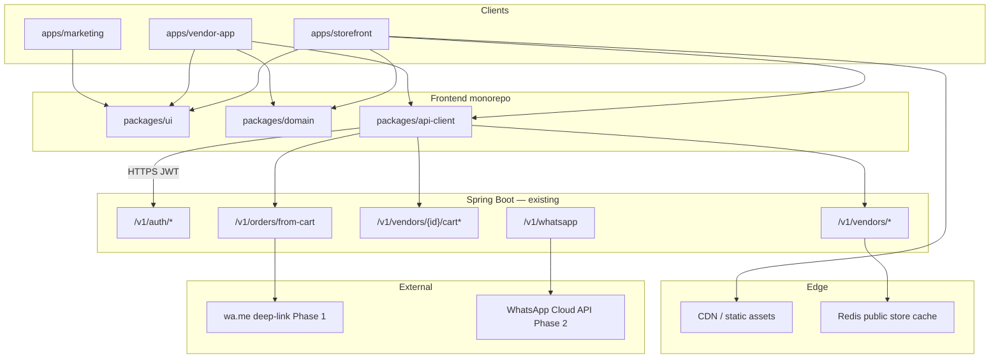
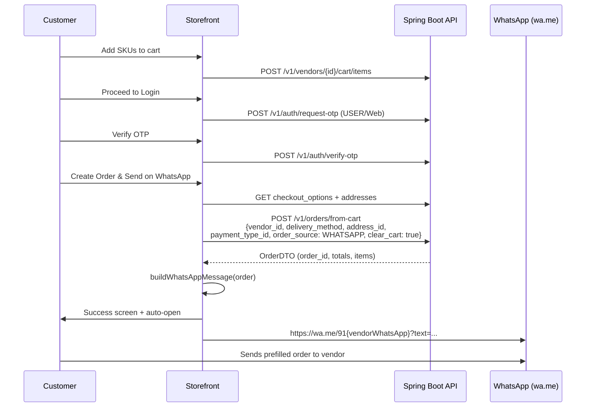
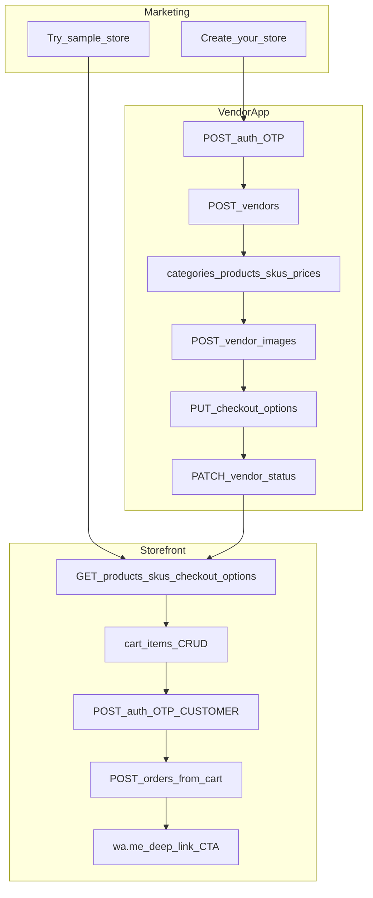

# MithraDirect SaaS — Plan & Design Document

**Status:** Implementation-ready  
**Audience:** Principal engineers, product, and frontend/backend implementers  
**Last updated:** 2026-08-01  
**Prototype repo:** `c:\Users\swamy\git\Website`  
**API base URL:** `https://subscriptionapp-wgf8.onrender.com/api`  
**OpenAPI:** [Swagger UI](https://subscriptionapp-wgf8.onrender.com/api/swagger-ui/index.html) · [OpenAPI JSON](https://subscriptionapp-wgf8.onrender.com/api/v3/api-docs)  
**OpenAPI title / version:** MithraDirect- / `v1` (~110 paths)

---

## 1. Executive summary

MithraDirect is a multi-tenant commerce SaaS that lets local vendors (especially home-food and small retail businesses) publish a branded web storefront and take orders that complete over WhatsApp. The current repository is a **static HTML/JS prototype** proving two flows:

1. **Vendor onboarding** — a 10-step wizard with live phone preview (`onboarding.html`).
2. **Customer storefront** — Sai Ram Home Foods sample (`store.html`) with home → menu → PDP → cart → OTP login → checkout → WhatsApp deep-link success.

This document specifies converting that prototype into a **React 19 + TypeScript monorepo** (marketing, vendor-app, storefront) wired to the existing **Java Spring Boot** backend, targeting **~10,000 vendor storefronts**.

**Locked decisions**

| Decision | Choice |
|----------|--------|
| Checkout channel | **Hybrid WhatsApp** — Phase 1 `wa.me` deep-link after order create; Phase 2 WhatsApp Cloud API via existing `/v1/whatsapp` webhook |
| Backend | Existing Spring Boot APIs (OpenAPI-first); no greenfield API rewrite |
| Frontend | React + TypeScript monorepo (Vite 6, Tailwind v4, TanStack Query, Orval) |
| Tenancy | **Vendor = tenant** (`vendor_id` as isolation key) |

**Product goals**

- Preserve proven Sai Ram UX patterns while shipping a 2026-grade design system.
- Make every surface CTA-measurable (Create store, Try sample, Create Order & Send on WhatsApp).
- Scale public catalog reads for 10k stores via CDN/cache — not sharding on day one.

---

## 2. Current state

### 2.1 Prototype inventory

| Surface | Entry | Scripts / styles | Persistence |
|---------|-------|------------------|-------------|
| Marketing | `index.html` | Inline Tailwind CDN + page CSS | None |
| Vendor onboarding | `onboarding.html` | `assets/js/onboarding.js`, `assets/js/store-draft.js`, `assets/css/onboarding.css` | `localStorage` draft via `MithraDraft` |
| Customer storefront | `store.html` | `assets/js/storefront.js`, `assets/js/store-draft.js`, `assets/css/storefront.css` (+ onboarding.css) | Cart `mithra_store_cart`, session `mithra_store_session`, draft from seeds / `?slug=` |

### 2.2 Vendor onboarding flow (demo)

10-step wizard with live preview pane (`PhonePreview` pattern):

1. Verify mobile (`Send OTP`) — demo accepts any phone  
2. Enter OTP (`Verify & Continue`) — demo: any 6 digits  
3. Choose business type  
4. Pick categories (max 2; custom category allowed)  
5. Add products  
6. Add variants / SKUs (label, price, MRP, active)  
7. Delivery options (store pickup / home / courier + charges)  
8. Payments (UPI, bank, COD)  
9. Store settings (name, tagline, location, WhatsApp, theme color, logo/banner)  
10. Store live — **View my store**, **Share on WhatsApp**, copy link  

Draft shape lives in `assets/js/store-draft.js` (`emptyDraft()`, `seedSaiRamDraft()`, `seedPickleDraft()`, etc.). Source of truth today is `localStorage`, not the API.

### 2.3 Sai Ram sample storefront flow

Default store: **Sai Ram Home Foods** (`slug: sai-ram-home-foods`, theme `#1B5E20`).

Views (SPA-style within `store.html`):

`home` → `menu` → `product` → `cart` → `login` → `checkout` → `success`

Notable UX already implemented:

- Full-bleed hero banner + brand name / tagline / trust chips  
- Sticky cart bar (“Go to Cart”)  
- Drawer nav, category rail, SKU steppers  
- Coupon stub (`MITHRA50` / `HOME50`) — client-only  
- Customer OTP login (demo)  
- Checkout: address, payment preference, terms  
- Primary CTA **Create Order & Send on WhatsApp** → client-generated order ID + `buildWhatsAppMessage()` → `wa.me` auto-open  

No live API calls today.

### 2.4 Marketing CTAs (today)

From `index.html`:

- Nav **Sample Store** → `store.html`  
- Nav / mobile **Get Started** → `onboarding.html`  
- Hero primarily Play Store + WhatsApp demo (`wa.me/919912149049`)  
- Vendor showcase includes Sai Ram → `store.html`  
- Bottom CTA **Join as Woman Entrepreneur** / setup → `onboarding.html`  

Target React marketing will rebalance CTAs to **Create your store** / **Try sample store** as primary product actions (see §4).

---

## 3. Goals & non-goals

### Goals

- Ship three deployable apps from one monorepo: marketing, vendor-app, storefront.  
- Generate a typed API client from OpenAPI (`packages/api-client`).  
- Wire onboarding and storefront to real auth, vendor, catalog, cart, and `POST /v1/orders/from-cart`.  
- Keep hybrid WhatsApp: **persist order first**, then deep-link; Phase 2 Cloud API without redesign.  
- Design system in `packages/ui` ported from storefront/onboarding CSS tokens.  
- Support ~10k published storefronts with cached public reads and CDN media.

### Non-goals (near-term)

- Replacing the Spring Boot backend or mobile native apps.  
- Full marketplace discovery as the primary storefront path (storefront is per-vendor slug).  
- Building a complete admin console (bulk import / approval remain backend/ops).  
- Instant online payment gateway UX beyond vendor payment preference + WhatsApp confirmation (COD/UPI preference is enough for Phase 1).  
- Sharding or multi-region DB on day one.

---

## 4. Product surfaces & CTAs

Every surface needs explicit, measurable CTAs (`cta_id` analytics later).

### 4.1 Marketing (`apps/marketing`)

| Placement | CTA label | Action |
|-----------|-----------|--------|
| Nav / Hero primary | **Create your store** | → vendor-app `/onboarding` |
| Nav / Hero secondary | **Try sample store** | → storefront `/sai-ram-home-foods` |
| Mid-page | **See WhatsApp checkout** | → sample store menu/cart deep link |
| Vendor showcase cards | **View live store** | → storefront `/{slug}` |
| Footer | **Start free setup** | → onboarding |
| Sticky mobile (optional) | **Open sample store** | → storefront |

### 4.2 Vendor onboarding (`apps/vendor-app`)

| Step / state | CTA | API behind it |
|--------------|-----|----------------|
| Phone | **Send OTP** | `POST /v1/auth/request-otp` (`user_role: VENDOR`, `reg_platform: Web`) |
| OTP | **Verify & continue** | `POST /v1/auth/verify-otp` |
| Steps 3–9 | **Continue** / **Save & continue** | Vendor / categories / products / SKUs / images / checkout_options |
| Step 10 | **View my store** | → `/{slug}` storefront |
| Step 10 | **Share on WhatsApp** | `wa.me/?text=` share link |
| Step 10 | **Copy store link** | clipboard |
| Dashboard (later) | **Go live** / **Manage orders** | `PATCH /v1/vendors/{vendor_id}/vendor_status`, orders list |

### 4.3 Customer storefront (`apps/storefront`) — mirror Sai Ram

| Placement | CTA | API / behavior |
|-----------|-----|----------------|
| Header WA | **WhatsApp** icon | `wa.me` greeting |
| Menu / PDP | **Add** / qty steppers | cart item APIs |
| Sticky bar | **Go to Cart** | navigate cart |
| Cart | **Apply** coupon | hide/stub until promo API |
| Cart | **Proceed to Login** | → customer OTP |
| Login | **Send OTP** / **Verify & Continue** | auth OTP (`CUSTOMER` / `USER` as backend expects) |
| Checkout | **Create Order & Send on WhatsApp** | `POST /v1/orders/from-cart` then success |
| Success primary | **Send Order on WhatsApp** | `wa.me` with structured message (auto-open) |
| Success secondary | **Continue Shopping** | → home |
| Empty store | **Open Sample Store** / **Setup Your Store** | sample slug / onboarding |

---

## 5. Target architecture

### 5.1 System diagram



### 5.2 Multi-tenant model

- **Tenant = vendor** identified by `vendor_id` (int64).  
- Public URLs use **slug** (`sai-ram-home-foods`); backend must eventually resolve slug → vendor (gap — see §14).  
- Cart is **per authenticated user per vendor** (API: same-vendor only; max 50 lines, qty 25, 24h TTL).  
- JWT carries role (`VENDOR`, `USER`/customer, `ADMIN`, `CUSTOMER_CARE`).  
- Storefront theming is tenant-scoped (`themeColor` → CSS variables); not a separate branding service.

### 5.3 Hybrid WhatsApp (principle)

1. Always create a durable order via API first.  
2. Phase 1: open `https://wa.me/91{whatsapp}?text={encoded}` with order summary.  
3. Phase 2: same order event can trigger Cloud API templates via `/v1/whatsapp` without changing the checkout screen contract.

---

## 6. Monorepo project structure

Replace flat HTML/JS at cutover (keep prototype as reference until then):

```text
mithradirect-web/
├── apps/
│   ├── marketing/                 # Public marketing (from index.html)
│   │   ├── src/
│   │   │   ├── pages/             # Home, Privacy, Terms
│   │   │   ├── sections/          # Hero, HowItWorks, VendorShowcase, FAQ
│   │   │   └── main.tsx
│   │   └── index.html
│   ├── vendor-app/                # Onboarding + vendor dashboard
│   │   ├── src/
│   │   │   ├── features/
│   │   │   │   ├── auth/
│   │   │   │   ├── onboarding/
│   │   │   │   ├── catalog/
│   │   │   │   ├── checkout-config/
│   │   │   │   ├── orders/
│   │   │   │   └── media/
│   │   ├── routes.tsx
│   │   └── main.tsx
│   │   └── index.html
│   └── storefront/                # Public /:storeSlug customer app
│       ├── src/
│       │   ├── features/
│       │   │   ├── home/
│       │   │   ├── menu/
│       │   │   ├── product/
│       │   │   ├── cart/
│       │   │   ├── auth/
│       │   │   ├── checkout/
│       │   │   └── success/
│       ├── routes.tsx
│       └── main.tsx
│       └── index.html
├── packages/
│   ├── api-client/                # Orval-generated client + wrappers
│   │   ├── openapi.json           # snapshot from /api/v3/api-docs
│   │   └── src/
│   ├── domain/                    # Zod schemas, money, slugify, WA message types
│   ├── ui/                        # Design system + tokens
│   │   └── src/
│   │       ├── styles/            # tokens.css, themes, motion
│   │       └── components/
│   ├── config-eslint/
│   ├── config-typescript/
│   └── config-tailwind/
├── package.json                   # pnpm workspaces
├── pnpm-workspace.yaml
├── turbo.json                     # optional
└── README.md
```

### Tooling (2026 baseline)

| Layer | Choice |
|-------|--------|
| Runtime UI | React 19 + TypeScript 5.x |
| Bundler | Vite 6+ |
| Routing | React Router 7 |
| Server state | TanStack Query v5 |
| Forms | React Hook Form + Zod |
| Styling | Tailwind CSS v4 + CSS variables (design tokens) |
| Motion | CSS View Transitions + modest Framer Motion / WAAPI |
| API | Orval from Swagger (or openapi-typescript + openapi-fetch) |
| Package manager | pnpm |
| Lint/format | ESLint flat config + Prettier |
| Tests | Vitest + Playwright (smoke: onboarding + WA checkout) |

### Environment

```bash
VITE_API_BASE_URL=https://subscriptionapp-wgf8.onrender.com/api
VITE_APP_ENV=development
VITE_SAMPLE_STORE_SLUG=sai-ram-home-foods
VITE_SAMPLE_VENDOR_ID=           # temporary until public slug API
```

---

## 7. UI/UX design direction (2026)

Port **layout and flows** from `assets/css/storefront.css` and `assets/css/onboarding.css`, restyled for a 2026 SaaS look — not generic purple/cream AI defaults.

### Principles

- **One composition per viewport** — marketing hero and storefront home stay brand-first (store name as hero signal).  
- **Token-driven theming** — promote existing `--store-theme`, `--store-theme-soft`, `--store-ink`, `--store-muted`, `--store-border`, `--store-radius`, `--store-safe-bottom`.  
- **Per-vendor theme** — inject vendor `themeColor` into CSS variables at runtime.  
- **Mobile-first commerce** — sticky cart bar, safe-area insets, drawer nav (keep sample UX).  
- **Motion with purpose** — view enter/exit (100–200ms), cart badge pulse, success check; no decorative glow spam.  
- **Typography** — expressive display + readable body (Poppins / Inter is acceptable interim; prefer purposeful pairing in `packages/ui`).  
- **Atmosphere** — soft gradient/mesh or light food photography; avoid flat white-only and purple-indigo clichés.  
- **No hero card clutter** — full-bleed banner + name/tagline/chips as in Sai Ram sample.

### `packages/ui` MVP components

`Button` (primary / outline / WhatsApp), `IconButton`, `Field`, `PhoneInput`, `OtpInput`, `Stepper`, `SkuStepper`, `ProductCard`, `CategoryChip`, `CartBar`, `Drawer`, `BillSummary`, `PayOption`, `AuthPanel`, `SuccessPanel`, `PhonePreview`, `DemoTopbar`, `EmptyState`.

### CSS architecture

```text
packages/ui/src/styles/
  tokens.css
  reset.css
  themes/vendor.css
  utilities.css
apps/*/src/styles.css   # @import "tailwindcss"; @theme { … }
```

Map Tailwind v4 `@theme` to the same tokens so all three apps stay consistent.

---

## 8. Domain model

Map prototype draft fields (`store-draft.js`) → API concepts.

| Prototype field | API concept | Notes |
|-----------------|-------------|-------|
| `phone`, `verified` | Auth OTP → JWT + `GET /v1/auth/profile` | Vendor: `user_role: VENDOR`; Customer: `USER` (confirm enum vs CUSTOMER) |
| `businessType` | `VendorProfileRequest.business_type` | Step 3 |
| `categories[]` | `PATCH /v1/vendors/{id}/categories` + platform `GET /v1/categories/` | Max 2 in UX |
| `products[]` | Category products + vendor product APIs | `POST /v1/categories/{category_id}/products/` then vendor assign/edit |
| `products[].variants[]` | SKUs via `POST /v1/vendors/{id}/skus` (`ItemSkuCreateRequest`) | `label`→SKU name/measure; `price`/`mrp`→`price_list` |
| `delivery.*` | `PUT /v1/vendors/{id}/checkout_options` (`SaveVendorDeliveryConfigRequest`) | Map to `fulfillment_type` HOME_DELIVERY / STORE_PICKUP / BOTH |
| `payment.*` | Same checkout_options `payment_options` | COD / UPI / bank → vendor payment config IDs |
| `settings.storeName` | `business_name` / vendor profile | |
| `settings.tagline` | Prefer `description` or **gap** dedicated field | |
| `settings.location` | `business_address` / geo service area | |
| `settings.whatsapp` | **Gap** on public DTO — store until API exposes | Required for Phase 1 deep-link |
| `settings.logo` / `banner` | `POST /v1/vendors/{id}/images`, `banner_image` | |
| `settings.themeColor` | **Gap** — inject client-side until API field exists | Sai Ram `#1B5E20` |
| `slug` | **Gap** `GET /v1/public/stores/{slug}` | Interim: env map slug→`vendor_id` |
| Cart lines | `POST/PUT/DELETE .../cart/items` | Body: `{ sku_id, quantity }` (`ItemRequest`) |
| Client order ID | `OrderDTO` from `POST /v1/orders/from-cart` | Stop generating fake IDs in production |
| `buildWhatsAppMessage()` | Client builder Phase 1; prefer `GET .../whatsapp-message` later | Port message structure from storefront.js |

### Product / SKU shape (prototype)

```text
product: { id, name, image, categoryId, rating?, description?, ingredients?, nutrition?, storage?, popular?, variants[] }
variant: { id, label, price, mrp, active }
```

PDP extras (`ingredients`, `nutrition`, `storage`, `rating`, `popular`) are prototype-only — treat as optional enrichment / gap (§14).

---

## 9. API design & contracts

**Envelope:** `APIResponse { success, status, message, timestamp, data }`  
**Server:** `https://subscriptionapp-wgf8.onrender.com/api`  
**Source of truth:** OpenAPI `v1` (~110 paths). Commit a snapshot to `packages/api-client/openapi.json`.

### 9.1 Auth

| Method | Path | UI use | Request highlights |
|--------|------|--------|--------------------|
| POST | `/v1/auth/request-otp` | Vendor + customer OTP send | `MobileSignUpRequest`: `country_code`, `mobile_number` (10-digit `^[6-9]\d{9}$`), `reg_platform` (`Web`), `user_role` (`VENDOR` / `USER`) |
| POST | `/v1/auth/verify-otp` | Verify & continue | `OTPVerificationRequest`: `country_code`, `mobile_number`, `otp` → JWT + refresh |
| POST | `/v1/auth/refresh` | Silent renew | Refresh token |
| GET | `/v1/auth/profile` | Bootstrap shell | Current user |
| POST | `/v1/auth/signout` | Sign out | |

### 9.2 Vendor

| Method | Path | UI use |
|--------|------|--------|
| POST | `/v1/vendors/` | Create profile — `VendorProfileRequest` (`business_name`, `business_type`, `banner_image`, fulfillment fields, …) |
| GET / PUT | `/v1/vendors/{vendor_id}` | Load / update settings |
| GET / PATCH | `/v1/vendors/{vendor_id}/categories` | Category assignment |
| PATCH | `/v1/vendors/{vendor_id}/vendor_status` | Go-live |
| PATCH | `/v1/vendors/{vendor_id}/approval_status` | Ops |
| GET / PATCH | `/v1/vendors/{vendor_id}/geo/service_area` | Delivery area |
| GET / PUT | `/v1/vendors/{vendor_id}/checkout_options` | Delivery + payment config (`SaveVendorDeliveryConfigRequest`) |
| GET / POST | `/v1/vendors/{vendor_id}/images` | Logo / banner / product media |

### 9.3 Catalog

| Method | Path | UI use |
|--------|------|--------|
| GET | `/v1/categories/`, `/v1/categories/grouped` | Onboarding category picks |
| POST | `/v1/categories/{category_id}/products/` | Add product |
| GET / PATCH | `/v1/vendors/{vendor_id}/products/{product_id}` | Vendor product edit |
| GET | `/v1/vendors/{vendor_id}/products` | Storefront home / menu |
| GET | `/v1/vendors/{vendor_id}/products/skus` | SKU list |
| POST | `/v1/vendors/{vendor_id}/skus` | Create SKU — `ItemSkuCreateRequest` + `price_list` |
| GET / PATCH / DELETE | `/v1/vendors/{vendor_id}/skus/{sku_id}` | SKU CRUD |
| GET | `/v1/sku/price/{sku_id}` | Price read |
| PUT | `/v1/sku/price/{price_id}` | Price / MRP update |
| GET | `/v1/vendors/{vendor_id}/skus/search` | Menu search |
| GET | `/v1/vendors/products/{product_id}/skus/{sku_id}` | PDP |
| GET | `/v1/deeplink?vendor_id=&product_id=&sku_id=` | Share / deep links |

### 9.4 Cart

| Method | Path | UI use | Notes |
|--------|------|--------|-------|
| GET | `/v1/vendors/{vendor_id}/cart` | Load cart | Auth required |
| POST | `/v1/vendors/{vendor_id}/cart/items` | Add line | `{ sku_id, quantity }` — max qty 25, max 50 items, 24h TTL, 409 if other vendor |
| PUT | `/v1/vendors/{vendor_id}/cart/items` | Upsert | |
| PUT / DELETE | `/v1/vendors/{vendor_id}/cart/items/{cart_item_id}` | Qty / remove | |
| DELETE | `/v1/vendors/{vendor_id}/cart` | Clear after success | Prefer `clear_cart: true` on order create |

### 9.5 Orders

| Method | Path | UI use | Notes |
|--------|------|--------|-------|
| POST | `/v1/orders/from-cart` | **Primary place-order CTA** | `CreateOrderFromCartRequest`: required `vendor_id`, `delivery_method`; optional `address_id`, `payment_type_id`, `order_timing_type`, `clear_cart`, `order_source` (`WHATSAPP` recommended for web WA flow), `notes` |
| POST | `/v1/orders` | Alternate direct create | `CreateOrderRequest` + items |
| GET | `/v1/orders/{order_id}` | Success / details | |
| GET | `/v1/users/{user_id}/orders/history` (+ paged, date-range, pdf, excel, email) | Customer history | |
| GET / PATCH | `/v1/vendors/{vendor_id}/orders/` … | Vendor inbox (Phase 4) | cancel, tracking, bulk-status-update |

**`CreateOrderFromCartRequest` highlights**

- `delivery_method`: `HOME_DELIVERY` | `STORE_PICKUP` | `BOTH`  
- HOME_DELIVERY needs `address_id` + `order_timing_type` (`INSTANT` | `FIXED_WINDOW` | `CUSTOMER_SELECT_DATE` | `PREDEFINED_DAYS`)  
- STORE_PICKUP needs `pickup_address_id` + `pickup_slot` (`Morning` / `Evening`)  
- `payment_type_id` must match vendor checkout-options payment config  

### 9.6 WhatsApp

| Method | Path | Phase | Use |
|--------|------|-------|-----|
| — | Client `wa.me/91{n}?text=` | **Phase 1** | After successful `orders/from-cart` |
| GET | `/v1/whatsapp` | Phase 2 | Meta webhook verify (`hub.mode`, `hub.challenge`, `hub.verify_token`) |
| POST | `/v1/whatsapp` | Phase 2 | `WhatsAppWebhookRequest` events |

### 9.7 Supporting (later)

| Area | Paths |
|------|-------|
| Subscriptions | `/v1/api/subscription-plans`, vendor/user `/subs` |
| FAQs | `/v1/faqs`, `/v1/faqs/{target_audience}` |
| Measurements | `/v1/measurements/` |
| Social | `/v1/social/{platform}/...` |
| Couriers | `/v1/courier-partners` |
| Admin import | `/v1/admin/vendor-bulk-import*` |

### 9.8 API gaps (blockers for full sample parity)

1. `GET /v1/public/stores/{slug}` — resolve public URLs without knowing `vendor_id`  
2. Public DTO fields: `themeColor`, `tagline`, `whatsapp`, logo/banner URLs  
3. Guest cart → merge on customer OTP login  
4. `GET /v1/orders/{id}/whatsapp-message` — server-owned WA text  
5. Optional PDP attributes (ingredients, nutrition, storage, rating, popular)  
6. Coupon codes (`MITHRA50`) — hide or stub until API exists  
7. `onboarding_step` on vendor for resume  
8. Confirm customer `user_role` enum (`USER` vs any CUSTOMER alias) for web storefront OTP  

**Interim:** map known demo slug → `vendor_id` via env/config; keep local theme/WhatsApp overrides for Sai Ram until public DTO lands.

---

## 10. WhatsApp hybrid checkout sequence

### Phase 1 — Deep-link (ship now)



**Message structure** (port from `storefront.js` `buildWhatsAppMessage`):

- Header: New Order — {storeName}  
- Order ID, Customer, Phone, Address, Payment  
- Item lines with qty and line totals  
- Subtotal, Delivery, Discount?, Total  
- Closing: “Please confirm my order.”

**Rules:** Never put bank account numbers or full card data in WA text. Prefer UPI ID only if vendor enabled it and customer chose UPI.

### Phase 2 — Cloud API (feature-flagged)

- Keep Phase 1 CTA as fallback.  
- On order create, backend optionally sends template via Cloud API.  
- Inbound events already modeled: `GET/POST /v1/whatsapp`.  
- Frontend may show “Message sent” vs “Open WhatsApp” based on flag `VITE_WA_CLOUD_ENABLED` + order response metadata.

---

## 11. Screen → API wiring



### Implementation checklist

| React screen | Primary CTA | Expected API |
|--------------|-------------|--------------|
| Marketing Home | Create your store / Try sample store | navigate only |
| Vendor OTP | Send / Verify | `POST /v1/auth/request-otp`, `POST /v1/auth/verify-otp` |
| Onboarding Business/Categories | Continue | `POST/PUT /v1/vendors`, categories PATCH |
| Onboarding Products/SKUs | Save & continue | products, `POST .../skus`, `PUT /v1/sku/price/{price_id}` |
| Onboarding Delivery/Pay | Continue | `PUT /v1/vendors/{id}/checkout_options` |
| Onboarding Media/Settings | Continue | `POST .../images`, `PUT /v1/vendors/{id}` |
| Onboarding Live | View my store / Share WhatsApp | `PATCH .../vendor_status` + navigate/share |
| Store Home | View menu / Add | `GET .../products`, cart POST |
| Store Menu/PDP | Add / steppers | cart items |
| Cart | Proceed to Login | — (ensure cart synced) |
| Customer Login | Send/Verify OTP | auth OTP |
| Checkout | Create Order & Send on WhatsApp | `GET checkout_options`, user addresses, `POST /v1/orders/from-cart` |
| Success | Send Order on WhatsApp | open `wa.me` (Phase 2: Cloud API) |
| Vendor Orders (Phase 4) | Manage / Update status | `GET/PATCH /v1/vendors/{id}/orders/...` |

---

## 12. Security, scale (10k), observability

### Security

- Store JWT + refresh securely (httpOnly cookie preferred if backend supports; else memory + refresh with XSS hygiene).  
- Role gates: vendor mutations require `VENDOR`; cart/order require authenticated customer.  
- Public GETs only for **published** stores (enforce via vendor_status / approval).  
- OTP rate limits (client UX + server).  
- No bank PII / full account numbers in WhatsApp messages.  
- CORS allowlist for marketing / vendor-app / storefront origins.  
- Validate `payment_type_id` and fulfillment against `checkout_options` only.

### Scale (~10k storefronts)

- **Do not shard day one** — Postgres indexes on `vendor_id`, slug (when added), product/sku FKs.  
- **CDN** for static apps + vendor media (object storage).  
- **Redis** (or CDN edge cache) for public catalog / store bootstrap payloads (TTL short, invalidate on vendor publish).  
- Cart stays user-scoped and short-TTL (already 24h).  
- Rate-limit auth OTP and cart writes.  
- Media: avoid huge base64 in browser long-term; use upload URLs from `POST .../images`.

### Observability

- Structured logs with `vendor_id`, `order_id`, `cta_id`, `request_id`.  
- Frontend error boundary + API error toast mapping from `APIResponse.message`.  
- Metrics: OTP success rate, cart→order conversion, WA deep-link click, p95 catalog latency.  
- Synthetic Playwright check: sample store add-to-cart → order path (staging).

---

## 13. Implementation plan / phases

### Phase 0 — Scaffold (1 sprint)

**Deliverables**

- pnpm monorepo + Vite apps + shared configs  
- Commit `openapi.json`; generate `packages/api-client` (Orval)  
- `packages/ui` tokens + Button / Field / CartBar stubs  
- CI: typecheck, lint, build  

### Phase 1 — Marketing + design system

**Deliverables**

- Port marketing sections; wire CTAs to vendor-app + sample storefront routes  
- 2026 visual pass on tokens / typography / motion  
- Privacy / Terms pages stubs if needed  

### Phase 2 — Vendor onboarding API

**Deliverables**

- Real auth OTP  
- Steps 1–10 mutations; live preview retained  
- Replace `mithra_store_draft` as source of truth with server vendor state (+ local draft cache only for offline UX)  

### Phase 3 — Storefront React + commerce API

**Deliverables**

- Port Sai Ram multi-view UX 1:1 functionally  
- Cart → customer OTP → `POST /v1/orders/from-cart` → WhatsApp CTAs  
- Config fallback slug→`vendor_id` until public slug API lands  
- Coupon UI hidden or clearly demo-only  

### Phase 4 — Vendor orders + polish

**Deliverables**

- Orders inbox using Vendors Order API  
- Empty/error states; analytics on CTAs (`cta_id`)  
- Address CRUD polish; checkout scheduling fields as API requires  

### Phase 5 — Scale & WhatsApp Phase 2

**Deliverables**

- Redis/CDN public store cache, media CDN, rate limits  
- Feature-flag Cloud API on `/v1/whatsapp`  
- Load test public catalog for 10k vendor IDs  

---

## 14. Open questions / backend gaps

| # | Question / gap | Impact | Interim |
|---|----------------|--------|---------|
| 1 | Public store-by-slug API | Blocks clean `/{slug}` routing | Env map for demo + known vendors |
| 2 | `themeColor`, `tagline`, `whatsapp` on public vendor DTO | Theming + WA deep-link | Client overrides / settings stored in description hack (avoid if possible) |
| 3 | Guest cart merge after OTP | Friction if cart requires auth before browse | Browse catalog anonymously; create cart after login (or local cart replay) |
| 4 | Server `whatsapp-message` endpoint | Message drift across clients | Shared `packages/domain` builder |
| 5 | Customer role enum for OTP | Auth failures | Confirm with backend: `USER` vs others |
| 6 | Coupons | Cart CTA | Hide Apply until API |
| 7 | `onboarding_step` persistence | Resume wizard | Local step + server profile completeness heuristic |
| 8 | PDP enrichment fields | Parity with Sai Ram accordions | Optional; omit if absent |
| 9 | `order_source: WHATSAPP` vs `APP` for web | Analytics | Prefer `WHATSAPP` for this channel |
| 10 | Address create API surface | Checkout “Add New Address” | Confirm user address endpoints beyond DELETE |

---

## 15. Appendix

### A. Key prototype file paths

| Path | Role |
|------|------|
| `index.html` | Marketing site + current CTAs |
| `onboarding.html` | 10-step vendor wizard markup |
| `store.html` | Sai Ram storefront shell (views, cart bar, success) |
| `assets/js/store-draft.js` | Draft model, seeds (`seedSaiRamDraft`), slugify, `whatsappLink` |
| `assets/js/onboarding.js` | Wizard logic, validation, finalize/share |
| `assets/js/storefront.js` | Multi-view storefront, cart, OTP demo, WA message, order success |
| `assets/css/storefront.css` | Store tokens, hero, cart bar, mobile shell |
| `assets/css/onboarding.css` | Wizard + shared demo chrome |
| `assets/img/vendors/sai-ram-home-foods-*.png` | Sample logo / banner |

### B. API references

- Swagger UI: https://subscriptionapp-wgf8.onrender.com/api/swagger-ui/index.html  
- OpenAPI JSON: https://subscriptionapp-wgf8.onrender.com/api/v3/api-docs  
- Base URL: `https://subscriptionapp-wgf8.onrender.com/api`  
- Canonical commerce path: **`POST /v1/orders/from-cart`** after cart + OTP  
- Canonical auth paths: **`POST /v1/auth/request-otp`**, **`POST /v1/auth/verify-otp`**  
- WhatsApp Phase 2: **`GET/POST /v1/whatsapp`**

### C. Sample store constants (prototype)

| Field | Value |
|-------|-------|
| Name | Sai Ram Home Foods |
| Slug | `sai-ram-home-foods` |
| Theme | `#1B5E20` |
| Tagline | Authentic taste of tradition |
| Demo WhatsApp | `9912149049` (Swamy Kunta) |

### D. Locked decisions (do not reopen without ADR)

1. Hybrid WhatsApp (deep-link now, Cloud API later)  
2. Java Spring Boot backend remains system of record  
3. React + TypeScript frontend monorepo  

---

*End of design document.*
